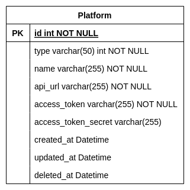

# Let's RUN Platform API Gateway

## I. What to do
In this service, you will develop a backend server side functions that handle the **platform** API resources.
This service will contain 2 sub-services which are the Rest and gRPC service. Rest service will handle the http requests 
while gRPC will handle the logic and data transaction to the MySQL database. This services will mainly serve as a 
reference data point for the **customer** service to function properly.

The platform model specification can be referred below:

## II. API Output
### Platform API Output
#### Get a platform by ID.
    - URL: [GET] {platform_url}/run/platform/{id}
    - Response: 
        {
            "id": "string",
            "type": "string",
            "name": "string",
            "api_url": "string",
            "access_token": "string",
            "access_token_secret": "string",
            "created_at": "string",
            "updated_at": "string"
        }
#### Create a customer.
    - URL: [POST] {platform_url}/run/platform
    - Payload:
        {
            "type": "string", // allowed values: "shopify", "woocommerce"
            "name": "string",
            "api_url": "string",
            "access_token": "string",
            "access_token_secret": "string"
        }
    - Response:
        {
            "id": "string",
            "type": "string",
            "name": "string",
            "api_url": "string",
            "access_token": "string",
            "access_token_secret": "string",
            "created_at": "string",
            "updated_at": "string"
        }
#### Update a customer by ID.
    - URL: [PUT] {platform_url}/run/platform/{id}
    - Payload:
        {
            "id": "string",
            "type": "string", // allowed values: "shopify", "woocommerce"
            "name": "string",
            "api_url": "string",
            "access_token": "string",
            "access_token_secret": "string"
        }
    - Response:
        {
            "id": "string",
            "type": "string",
            "name": "string",
            "api_url": "string",
            "access_token": "string",
            "access_token_secret": "string",
            "created_at": "string",
            "updated_at": "string"
        }
#### Delete a platform by ID.
    - URL: [DELETE] {platform_url}/run/platform/{id}
    - Status: 200
#### List platforms by page and limit
    - URL: [GET] {platform_url}/run/platforms
    - Query: ?page=1&limit=10
    - Response:
        {
            "items": [
                {
                    "id": "string",
                    "type": "string",
                    "name": "string",
                    "api_url": "string",
                    "access_token": "string",
                    "access_token_secret": "string",
                    "created_at": "string",
                    "updated_at": "string"
                },
                ...
            ]
            "max_page": 0,
            "total_count": 0,
            "page": 1,
            "limit": 10,
        }